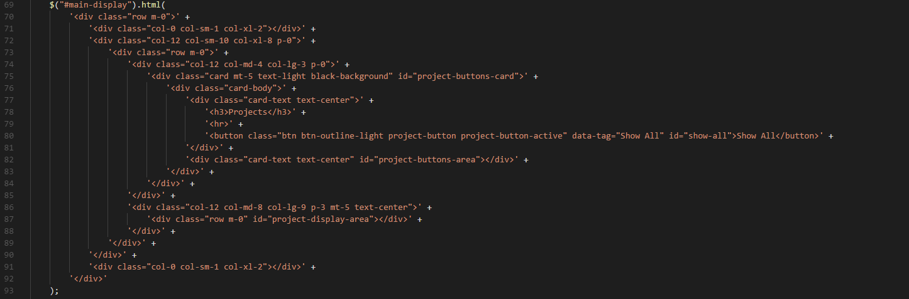

# Portfolio

This is a mobile responsive portfolio that features filtering of my projects by technologies used.

## Getting Started

Open up the [project link](https://robertshaw87.github.io/Portfolio/) and you should be able to see the webpage shown below:

### Prerequisites

You need to have a modern browser able to handle html5, javascript, and css. 

### Installing

No installation needed! Just open the page in your preferred browser.

## Built With

* Html

* CSS

* [Javascript](https://www.javascript.com/) - The scripting language used

* [BootstrapCDN v4.1.0](https://getbootstrap.com/docs/4.1/getting-started/introduction/) - The web framework used

* [jQuery v3.3.1](http://jquery.com/) - Java library for DOM and CSS manipulation

* [Animate CSS v3.5.2](https://daneden.github.io/animate.css/) - Animation library

* [Google Fonts](https://fonts.google.com/) - Font repository

## Challenges

I tried a different style of dynamic generation. Instead of creating multiple elements with jQuery and appending them together, I used the .html() method to input a long string of html that I concatenated together. It ends up being much easier to read depending on my formatting.

## Authors

* **Robert Shaw** - *Initial work* - [robertshaw87](https://github.com/robertshaw87)
